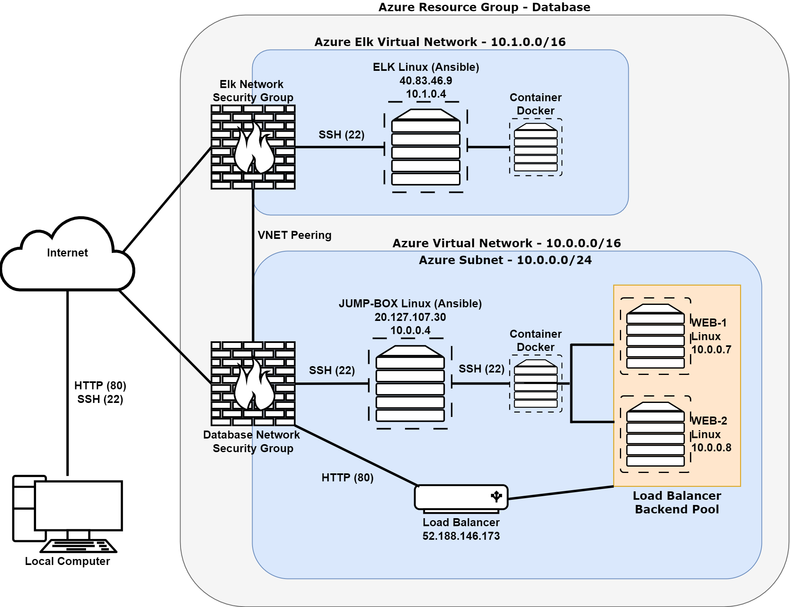
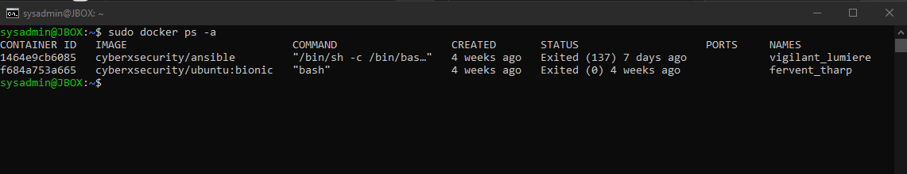

# DU_CYBER_PROJ_1
DU Cybersecurity Bootcamp - ELK Stack, Bash Scripting, Network Security

## Automated ELK Stack Deployment

The files in this repository were used to configure the network depicted below.

These files have been tested and used to generate a live ELK deployment on Azure. They can be used to either recreate the entire deployment pictured above. Alternatively, select portions of the Ansible playbook file may be used to install only certain pieces of it, such as Filebeat.

  - _Filebeat Playbook (filebeat-playbook.yml)_

This document contains the following details:
- Description of the Topologu
- Access Policies
- ELK Configuration
  - Beats in Use
  - Machines Being Monitored
- How to Use the Ansible Build

### Description of the Topology

The main purpose of this network is to expose a load-balanced and monitored instance of DVWA, the Damn Vulnerable Web Application.

Load balancing ensures that the application will be highly reliable and will increase capacity, in addition to restricting unapproved IP addresses to the network.
- _Load balancers allow for traffic to distribute traffic across the DVWAs and adds additional security for servers that become overwhelmed with traffic. The load balancer help protect the availability of information and resources. The Jump Box provides an extra layer of security in the network, as it is hardened and prevents all Azure virtual machines from being exposed to the public._

Integrating an ELK server allows users to easily monitor the vulnerable VMs for changes to the log files and system configuration.
- _Filebeat monitors log files, collects log events, and forwards them to Elasticsearch for remote machines._
- _Metricbeat records metrics from the operating system and send that data to Elasticsearch._

The configuration details of each machine may be found below.

| Name     | Function | IP Address | Operating System |
|----------|----------|------------|------------------|
| Jump Box | Gateway  | 10.0.0.4   | Linux B1s        |
| WEB1     | DVWA     | 10.0.0.7   | Linux B1ms       |
| WEB2     | DVWA     | 10.0.0.8   | Linux B1ms       |
| ELK      | ELK      | 10.1.0.4   | Linux B2s        |

### Access Policies

The machines on the internal network are not exposed to the public Internet.

Only the local host machine can accept connections from the Internet. Access to this machine is only allowed from the following IP addresses:
- _[IP]_

Machines within the network can only be accessed by the Jump Box docker container.
- _The Jump Box container (IP Address 20.127.34.116) can SSH into the DVWAs and Elk virtual machine (23.99.138.193)._

A summary of the access policies in place can be found in the table below.

| Name     | Publicly Accessible | Allowed IP Addresses |
|----------|---------------------|----------------------|
| Jump Box |  No                 | [IP]                 |
| WEB1/WEB2|  No                 | 20.127.34.116        |
| ELK      |  No                 | Virtual Network      |

### Elk Configuration

Ansible was used to automate configuration of the ELK machine. No configuration was performed manually, which is advantageous because...
- _Ansible automates the configuration of machines and requires no manual effort to configure machines one-by-one. Rather, Ansible is used to automate the configuration by leveraging YAML playbooks._

The playbook implements the following tasks:
- _Install docker.io and pip3._
- _Install the docker python module._
- _Update sysctl module to enable more memory._
- _Download and launch a docker elk container._

The following screenshot displays the result of running `docker ps -a` after successfully configuring the ELK instance.

### Target Machines & Beats
This ELK server is configured to monitor the following machines:
- _WEB1 + WEB2 - 52.188.146.173_

We have installed the following Beats on these machines:
- _Filebeat_
- _Metricbeat_

These Beats allow us to collect the following information from each machine:
- _Filebeat collects log data from the DVWAs and forwards those events to Elasticsearch._
- _Metricbeat collects data on the operating system, services running on the server, and CPU usage. Metricbeat then forwards these events to Elasticsearch._

### Using the Playbook
In order to use the playbook, you will need to have an Ansible control node already configured. Assuming you have such a control node provisioned:

SSH into the control node and follow the steps below:
- Copy the filebeat YAML files to the Ansible directory in /etc/.
- Update the filebeat configuration file to include the Elk host private IP address.
- Run the playbook, and navigate to the DVWAs to check that the installation worked as expected.

- _The file filebeat-playbook.yml is the playbook that must be copied into the Ansible directory._
- _Update the configuration file filebeat-config.yml to make Ansible run the playbook on the correct machine. Under the Eslasticsearch output and Kibana configuration settings, add the ELK Virtual machine private IP address as the host._
- _Navigate to http://52.188.146.173:5601/app/kibana in order to check that the ELK server is running.
